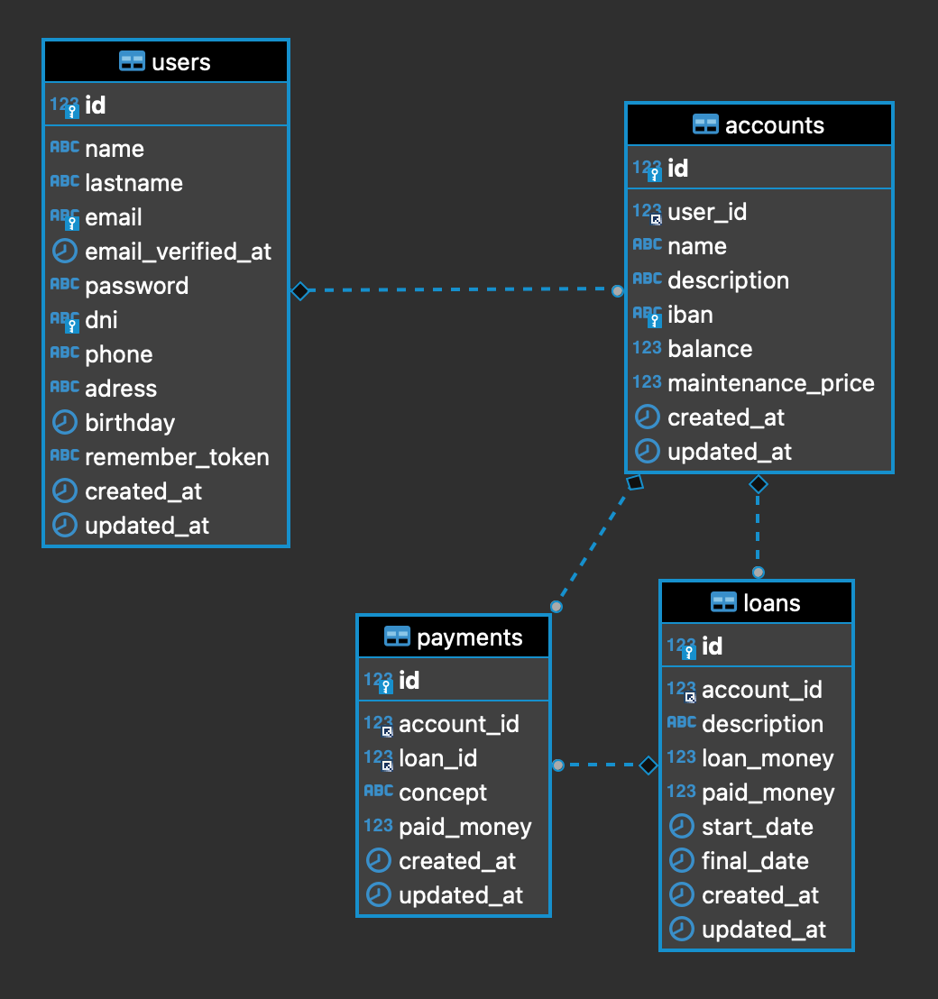

<h1 align="center">
   AIUDO BANK
</h1>

## Instructions 🔧

The first step is to clone the repository and install the project dependencies in your local repository.

### `composer install`

Create the .env file and fill it with the values ​​from your database.

##### `DB_CONNECTION=mysql`
##### `DB_HOST=127.0.0.1`
##### `DB_PORT=3306`
##### `DB_DATABASE=laravel`
##### `DB_USERNAME=root`
##### `DB_PASSWORD=password`

Migrate the models to the database

### `php artisan migrate`

### `php artisan passport:install`

Run the server.

### `php artisan serve`

Finally, enter the endpoints petitions in Postman and send them.

## Endpoints

## Models relation

## Used technologies

    

Installed dependencies: PASSPORT/LARAVEL 

## Developer ✍️

[Adriana Fayos](https://github.com/AdrianaFayos)

---