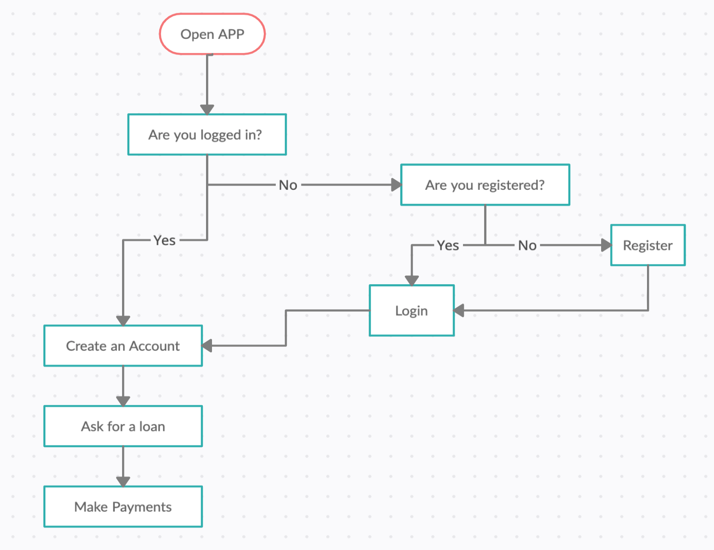

<h1 align="center">
   AIUDO BANK
</h1>

This challenge consists of creating a private API rest with Laravel that simulates a basic bank system where users could make different operations.

## Instructions 🔧

The first step is to clone the repository and install the project dependencies in your local repository.

### `composer install`

Create the .env file and fill it with the values ​​from your database.

##### `DB_CONNECTION=mysql`
##### `DB_HOST=127.0.0.1`
##### `DB_PORT=3306`
##### `DB_DATABASE=laravel`
##### `DB_USERNAME=root`
##### `DB_PASSWORD=password`

Migrate the models to the database

### `php artisan migrate`

### `php artisan passport:install`

Run the server.

### `php artisan serve`

Finally, enter the endpoints petitions in Postman and send them.

## Endpoints

- Register
   - POST /api/register --> Register a new user and returns a token.

- Login
   - POST /api/login --> Login a created user and returns a token.

- User
   - GET /api/users --> Shows all the users. (Only allowed user with id=1)
   - GET /api/users/profile --> Shows one user by id. 
   - PUT /api/users/update/password --> Updates user's password.

- Accounts
   - GET /api/account --> Shows all the accounts. (Only allowed user with id=1)
   - POST /api/account --> Creates a new account. (Only allowed user with id=1)
   - GET /api/account/user --> Shows user's accounts. 
   - PUT /api/account/{ID} --> Updates accounts basic information.
   - DELETE /api/account/{ID}--> Deletes one account.

- Loans
   - GET /api/loan --> Shows all the loans. (Only allowed user with id=1)
   - POST /api/loan --> Creates a new loan. (Only allowed user with id=1)
   - GET /api/loan/user --> Shows user's loans. 
   - DELETE /api/loan/{ID}--> Deletes one loan.

- Payments
   - GET /api/payment --> Shows all the payments. (Only allowed user with id=1)
   - POST /api/payment --> Creates a new payment.
   - GET /api/payment/user --> Shows user's payments. 

## Models relation and Flowchart

## Used technologies

    

Installed dependencies: PASSPORT/LARAVEL 

## Developer ✍️

[Adriana Fayos](https://github.com/AdrianaFayos)

---